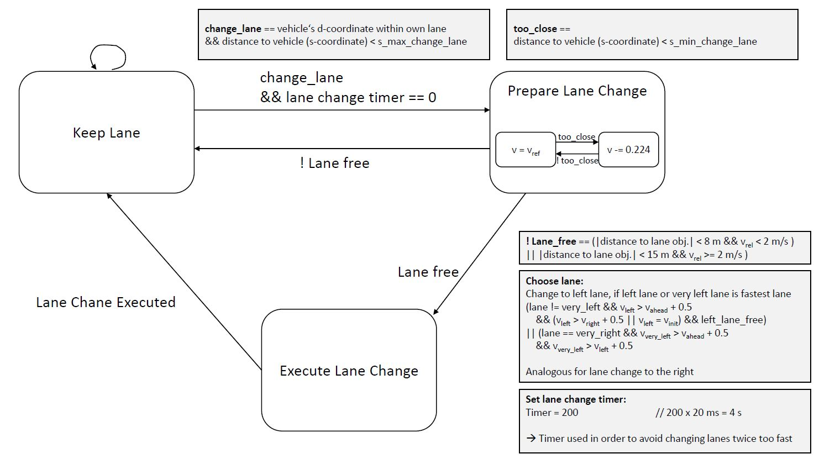

# CarND-Path-Planning
Path-Planning part of Nanodegree "Self-driving car engineer"


## Getting Started
For getting in touch with term3-simulator I implemented a constant velocity of 0,5 m / 20 ms = 25 m/s: 
```c++
// "getting started" --> move with 50 km/h in heading direction
double dist_inc = 0.5;        // every frame, add 0.2 m to x; 0.5 m / 20 ms = 25 m/s = 90 km/h = 56 mph
for (int i = 0; i < 50; ++i) {
    next_x_vals.push_back(car_x + (dist_inc * i) * cos(deg2rad(car_yaw)));
    next_y_vals.push_back(car_y + (dist_inc * i) * sin(deg2rad(car_yaw)));
}
```
The second given example introduces a steering movement by PI / 100: 
```c++
// "more complex paths"
double pos_x;
double pos_y;
double angle;
int path_size = previous_path_x.size();

for (int i = 0; i < path_size; ++i) {
  next_x_vals.push_back(previous_path_x[i]);        // new path = old path
  next_y_vals.push_back(previous_path_y[i]);
}

if (path_size == 0) {                                 // if old path empty, first position = car_position
  pos_x = car_x;
  pos_y = car_y;
  angle = deg2rad(car_yaw);
}
else {
  pos_x = previous_path_x[path_size - 1];           // if old path exists, first position = last_position from old path
  pos_y = previous_path_y[path_size - 1];

  double pos_x2 = previous_path_x[path_size - 2];
  double pos_y2 = previous_path_y[path_size - 2];
  angle = atan2(pos_y - pos_y2, pos_x - pos_x2);
}

double dist_inc = 0.5;
for (int i = 0; i < 50 - path_size; ++i) {            // for new path, add PI/100
  next_x_vals.push_back(pos_x + (dist_inc)*cos(angle + (i + 1) * (pi() / 100)));
  next_y_vals.push_back(pos_y + (dist_inc)*sin(angle + (i + 1) * (pi() / 100)));
  pos_x += (dist_inc)*cos(angle + (i + 1) * (pi() / 100));
  pos_y += (dist_inc)*sin(angle + (i + 1) * (pi() / 100));
}
```
Next step to stay in lane by using s, d - coordinates from loaded map (needed to change path `string map_file_ = "../../../data/highway_map.csv";`: 
```c++
// keep in lane example
double dist_inc = 0.5; 
for (int i = 0; i < 50; ++i) {
  double next_s = car_s + dist_inc * (i+1);           // car moves forward by dist_inc
  double next_d = 6;                                // car starts in middle lane = 1,5 lanes from middle line = 1,5 * 4 m = 6 m              
  vector<double> xy = getXY(next_s, next_d, map_waypoints_s, map_waypoints_x, map_waypoints_y);
  next_x_vals.push_back(xy[0]);
  next_y_vals.push_back(xy[1]);
}         
```
## Car following
```c++
// initialization within main()
double ref_vel = 0;           // start at 0.0 in order to avoid high gradients in acceleration

// car-following within onMessage()
// car-following part beneath --> set reference velocity (video until 48:56 minutes)

bool too_close = false;         // variable if target object gets too close (30 m)

// find ref_v to use --> no car ahead: ref_vel; or car_velocity --> look for relevant vehicles in my lane
for (int i = 0; i < sensor_fusion.size(); i++) {
  // sensor_fusion:
  // 0: car id  
  // 1: position in x
  // 2: position in y
  // 3: relative velocity in x-dir
  // 4: relative velocity in y-dir
  // 5: car's s-position (longitudinal)
  // 6: car's d-position (lateral)
  float d = sensor_fusion[i][6];        

  // if car is in my lane (lane width = 4 m
  if (d < (2 + 4 * lane + 2) && d >(2 + 4 * lane - 2)) {
        double vx = sensor_fusion[i][3];
        double vy = sensor_fusion[i][4];
        double check_speed = sqrt(vx * vx + vy * vy);
        double check_car_s = sensor_fusion[i][5];

        check_car_s += (double)prev_size * 0.02 * check_speed;    // if using previous points can project s value out

        // check s values greater than mine and s gap lower than 30 m
        if ((check_car_s > car_s) && (check_car_s - car_s) < 30) {                                                
            //ref_vel = 29.5;       // only sets speed stupidly to 29.5 mph, if object ahead is detected
            too_close = true;                 

            // if an object is detected and we are on one of the right lanes, go to lane 0
            // lane change is done in 30 m (seen in waypoints)
            if (lane > 0)
            {
                lane = 0;
            }
        }                    
  }
}

// if too close to object ahead, slow down; if far enough away, speed up
double max_vel = 49.5;
if (too_close) {          // if a car is ahead, decelerate
  ref_vel -= .224;        // 0.224 mph = 0.01 m/s
}
else if (ref_vel < max_vel) {
  ref_vel += .224;        // if no car is ahead, accelerate
}
```

## Changing Lanes
For a more in-depth look at the developed algorithm for changing lanes, following state chart was created. 



### Lane Free Detection
For detecting if a target lane is free, following code is executed
```c++
// check if left lane is free              
if (lane > 0) {                                                         // ego car is not yet on the very left lane
    if ((car_lane * 4 - 4 < d) && (d < car_lane * 4)) {                 // another car is in left lane
        if (((abs(s - (car_s - 2)) < 8) && ((speed - car_speed) < 2))   // and in relevant safety distance +/- 10 m at low v_rel or +/- 20 m at higher v_rel
      || ((abs(s - (car_s - 2)) < 15) && ((speed - car_speed) < 4))     
      || ((abs(s - (car_s - 2)) < 25) && ((speed - car_speed) >= 4)))   // took s - (car_s - 2) since car coordinate system is in front of vehicle --> shift to center
      {
          left_free = false;                                            // left lane is not possible            
          if (debug)
              std::cout << "car on left too close" << std::endl;
      }

      if ((s - car_s < max_det_dist) && (s > car_s) && (s - car_s < s_left)) {   // check if car is in front of ego and the one on the left lane which is next to us
          v_left = speed;                                      // store speed
          s_left = s - car_s;
          if(debug)
            std::cout << "car left detected with " << v_left << " in " << s_left << " m." << std::endl;
      }
  }
}

// check if very left lane is free (in case of lane ahead and lane left is occupied, but very left lane is free
if (lane > 1) {
  if ((car_lane * 4 - 8 < d) && (d < car_lane * 4 - 4)) {                           // another car is in very left lane
      if ((s - car_s < max_det_dist) && (s > car_s) && (s - car_s < s_veryLeft)) {  // check if car is in front of ego and the one on the left lane which is next to us
          v_veryLeft = speed;
          s_veryLeft = s - car_s;
      }
  }
}
```
There are three different minimum distances of the cars on the target lanes which are allowed for a lane change, depending on the relative velocity to our ego car. Furthermore, the coordinate system has its origin in the front of the ego car, s.t. for balancing the distance to the car's center, 2 m are subtracted from `car_s`.

### Choosing Target Lane
The target lane should allow the fastest way of traveling. Therefore following policy is introduced:
```c++
if ((change_lane) && (timer == 0)) {
    // taken out: (v_left >= v_right + 0.5) --> right lane better, if velocity is higher. But initialized to 100 if empty; 
    if (((lane > 0) && (v_left > v_ahead + 0.5) && ((v_left > v_right + 0.5) || (v_left == v_init))   // normal case for changing only one lane
      || (lane == 2) && (v_veryLeft > v_ahead + 0.5) && (v_veryLeft > v_left + 0.5))
      && (left_free)) {
            lane--;       // change to left
            timer = 200;  // timer set to 100 --> avoid new lane change for 200 cycles * 20 ms = 4.000 ms
            smin_change_lane = 15;                // during lane change it is possible to driver closer to target object until timer counted down
            if(debug)
                std::cout << "Change to left lane " << lane << std::endl;
    } 
```
As shown in the code snippet, not only the lane next to us is considered, but the very left lane as well. By comparing the velocities of the cars on each lane, the fastest lane will be chosen. This helps the system to change from the very right to the very left lane, even if the lane in the middle is not faster than our own on the right.
A timer is startet when the actual lane change is executed (```lane--```). This timer prevents the car to change lanes too fast after another. 

### Calculating the spline
The calculation of the spline is based on the ```integer lanes``` variable with possible values between 0 (very left lane) and 2 (very right lane). For calculating the spline, the suggested library from Tino Kluge is used. First, a vector with current car's position is created, as well as the last knwon position from the previous frame. Then in Frenet-coorindates, the target location of the car at the next waypoints are calculated (```car_s + 30 / 60 / 90``` and (```car_d = 2 + 4 * lane```). Then the car's reference angle is shifted to 0°. 
The spline is then created from the vector. 
In order to reach the given velocity, the spline points are splitted up in a way, that the target_y-value is changed depending on the target_distance. 
(i used the method shown in the FAQ-video section.)

## Potentials of the current implementations
The suggested implementation works very well as can be seen in following pictures: 


But it has some potentials: 
* Instead of setting the minimum distance for lane-free-detection to certain, relative velocity depending distances, the actual time to collision could be considered and be a basis for a better distance calculation with some security offset.
* Other cars lateral movement could be considered, such that their lane changes are considered during decision step. In my current implementation, a lane change of another car after an ego lane change could result in a crash, since after a lane change the target distnce to the object is lowered for comfort reasons.


